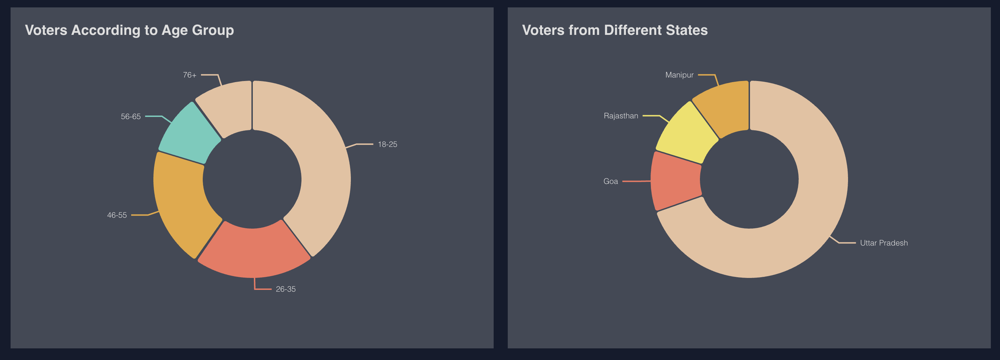

# Online Voting System

An **Online Voting System** built with the **MERN stack** (MongoDB, Express.js, React.js, Node.js).  
This system allows users to participate in **elections, polls, surveys**, and more.

---

## Screenshots

### Homepage


### Welcome Page


### Registration / Sign Up


### Voter Dashboard


### Voters by State & Age


### Admin Dashboard


### Admin Candidate Management


### Candidates Page


### Mongo Compass


---


## Features

- **User Authentication:** Secure login and authorization using JWT.  
- **Voting Dashboard:** View ongoing and upcoming voting events.  
- **Voting Interface:** Cast votes easily with an intuitive UI.  
- **Admin Panel:** Create, manage, and monitor voting events.  
- **Real-time Updates:** Instant notifications using WebSocket.  
- **Data Security:** Ensures user privacy and data integrity.  

---

## Technologies Used

- **Frontend:** React.js  
- **Backend:** Node.js, Express.js  
- **Database:** MongoDB  
- **Authentication:** JSON Web Tokens (JWT)  
- **Real-time Updates:** WebSocket  
- **UI Framework:** Material-UI  

---

## Getting Started

### Prerequisites
- Node.js installed
- MongoDB setup

### Installation
1. Clone the repository:
```bash
git clone https://github.com/SaniyaParveenCode/Online-Voting-App

2. Install dependencies:
cd server
npm install
cd ../client
npm install

3.Configure environment variables in server/.env:
MONGODB_URI=your_mongodb_connection_string
JWT_SECRET=your_secret_key

4.Start the server:
cd server
npm start

5.cd ../client
npm start

###Contributing

Contributions are welcome!

1. Fork the repository.

2.Create a new branch:

git checkout -b feature/YourFeature


3. Commit your changes:

git commit -am "Add some feature"


4. Push to the branch:

git push origin feature/YourFeature


5. Create a Pull Request.

License: MIT License
