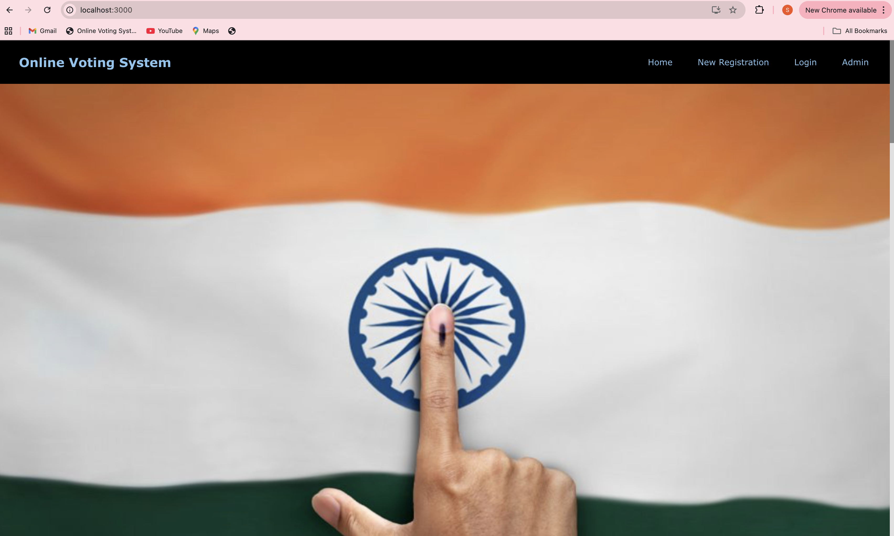

# Online Voting System

An enterprise-grade **Online Voting System** built with the **MERN Stack (MongoDB, Express.js, React.js, Node.js)**.
This application provides a secure, transparent, and user-friendly platform for conducting online elections, polls, and surveys.

---

## Key Features

* **User Authentication** – Secure login and registration using JWT.
* **Voting Dashboard** – Interactive dashboard to track active and upcoming elections.
* **Voting Interface** – Simple and intuitive interface for casting votes.
* **Admin Panel** – Manage candidates, voters, and monitor live voting activity.
* **Real-time Updates** – WebSocket integration for instant result updates.
* **Data Security** – Implements encryption and data integrity protection.
* **Responsive UI** – Modern design built with Material UI for a seamless experience on all devices.

---

## Technologies Used

| Category                    | Technologies                     |
| --------------------------- | -------------------------------- |
| **Frontend**                | React.js, Material UI            |
| **Backend**                 | Node.js, Express.js              |
| **Database**                | MongoDB                          |
| **Authentication**          | JSON Web Tokens (JWT), bcrypt.js |
| **Real-time Communication** | WebSocket                        |
| **Hosting**                 | Netlify / Render / MongoDB Atlas |

---

## Screenshots

## Homepage


## Candidates Page


## Voter Stats


## Welcome Screen


## Voter Registration


## Mongo Compass Setup


## Sign In


## Admin Dashboard


## Admin Candidate Page


## Getting Started

Follow these steps to set up the project locally:

```bash
# Clone the repository
git clone https://github.com/gurneeshs/Online-Voting-System.git

# Navigate to the project directory
cd Online-Voting-System

# Install server dependencies
cd server
npm install

# Install client dependencies
cd ../client
npm install

# Configure environment variables
# (Create .env file inside /server)
# Example:
# MONGO_URI=your_mongo_connection_string
# JWT_SECRET=your_secret_key

# Run the server
npm start

# Run the client
cd ../client
npm start
```

---

## Contributing

Contributions are welcome!
To contribute:

1. Fork the repository
2. Create a new branch (`git checkout -b feature-name`)
3. Commit your changes (`git commit -m "Add new feature"`)
4. Push to your branch (`git push origin feature-name`)
5. Create a Pull Request

---

## License

This project is licensed under the **MIT License**.
Feel free to use and modify it for educational or professional purposes.

---

## Contact

For any queries or collaborations, please reach out via GitHub Issues or Discussions.
